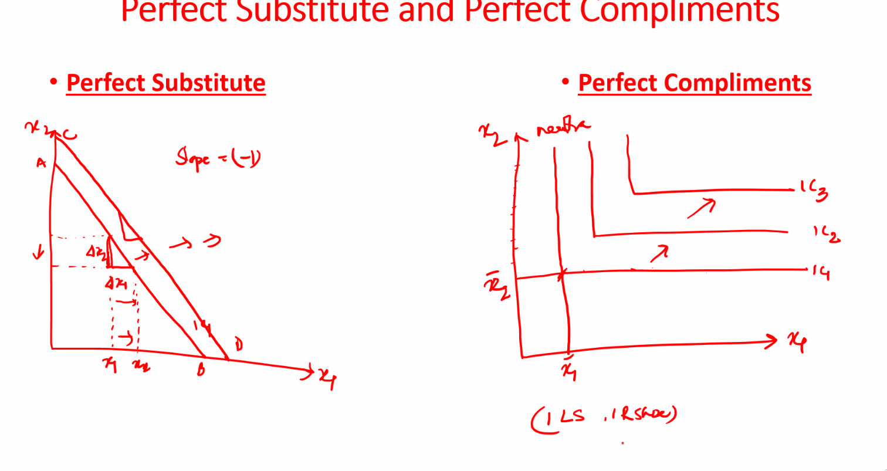

# Thursday, January 27, 2022

## Budget Line

$P_1x_1 + P_2x_2 \le m$
$P_1x_1 + P_2x_2 = m$
where, $P_i$ is price of $i$ with quantity $x_i$ and $m$ is income.

Since income and $P_i$ is constant,

$P_1 dx_1 + P_2 d x_2 = 0$
Hence, 
$\frac{dx_1}{dx_2} = -\frac{p_2}{p_1}$

This is the slope of the budget line. 

<svg id="svg" viewbox="-1.630000114440918,5.539999961853027,326,222.67001342773438" style="height:222.67001342773438"><path d="M 41.04,36.88 L 41.04,40.88 L 41.04,46.88 L 41.04,61.54 L 41.04,72.88 L 41.04,88.21 L 41.04,96.88 L 41.04,104.88 L 41.04,112.21 L 41.04,114.88 L 41.04,116.21 L 41.04,120.88 L 41.04,128.88 L 41.7,134.21 L 42.37,140.21 L 43.7,146.88 L 43.7,153.54 L 43.7,157.54 L 43.7,158.88 L 43.7,160.88 L 43.7,163.54 L 43.7,164.21 L 43.7,164.88" fill="none" stroke="#6190e8" stroke-width="2"></path><path d="M 37.7,42.88 L 37.7,42.21 L 37.7,41.54 L 37.7,40.88 L 37.7,38.88 L 39.04,38.21 L 39.7,36.88 L 40.37,36.21 L 41.04,35.54 L 41.04,34.88 L 42.37,33.54 L 42.37,32.88 L 42.37,32.21 L 43.04,32.21 L 43.04,32.21 L 43.04,32.88 L 43.04,34.88 L 43.04,36.88 L 43.04,37.54 L 43.04,39.54 L 43.04,40.21" fill="none" stroke="#6190e8" stroke-width="2"></path><path d="M 8.37,15.54 L 9.04,16.21 L 9.7,16.88 L 12.37,18.21 L 14.37,20.21 L 16.37,20.88 L 17.04,20.88 L 17.04,22.21 L 17.04,22.88 L 17.7,22.88 L 17.7,23.54 L 18.37,23.54 L 18.37,24.88" fill="none" stroke="#6190e8" stroke-width="2"></path><path d="M 18.37,17.54 L 18.37,18.21 L 18.37,19.54 L 17.7,19.54 L 17.7,20.88 L 17.04,20.88 L 17.04,21.54 L 16.37,21.54 L 15.04,22.21 L 14.37,22.21 L 13.7,22.21 L 13.7,22.88 L 13.04,23.54 L 13.04,24.88 L 12.37,24.88 L 12.37,25.54" fill="none" stroke="#6190e8" stroke-width="2"></path><path d="M 25.04,25.54 L 25.7,25.54 L 27.04,25.54 L 27.7,25.54 L 29.04,25.54 L 29.7,25.54 L 30.37,25.54 L 30.37,26.21 L 30.37,26.88 L 30.37,27.54 L 30.37,28.21 L 29.7,28.88 L 28.37,28.88 L 27.7,30.21 L 27.04,30.21 L 26.37,30.88 L 25.7,30.88 L 25.7,31.54 L 26.37,31.54 L 27.04,31.54 L 27.7,31.54 L 28.37,31.54 L 29.04,31.54 L 30.37,31.54 L 31.04,31.54 L 31.7,31.54 L 31.7,31.54 L 32.37,31.54" fill="none" stroke="#6190e8" stroke-width="2"></path><path d="M 45.7,165.54 L 47.7,166.21 L 50.37,168.21 L 55.7,170.88 L 62.37,173.54 L 80.37,176.88 L 91.04,178.88 L 98.37,179.54 L 105.04,180.21 L 114.37,180.21 L 125.04,182.21 L 129.04,182.21 L 133.04,182.21 L 138.37,182.88 L 141.7,184.21 L 146.37,184.21 L 154.37,184.21 L 158.37,184.21 L 163.04,184.21 L 166.37,184.21 L 173.04,184.21 L 176.37,184.21 L 179.7,184.21 L 182.37,184.21 L 185.04,184.21 L 186.37,184.21 L 187.7,184.21 L 192.37,184.21 L 197.7,182.88 L 205.04,182.21 L 210.37,182.21 L 215.7,182.21 L 219.04,182.21 L 221.7,182.21 L 224.37,182.21 L 229.04,181.54 L 232.37,181.54 L 234.37,181.54 L 237.7,181.54 L 240.37,180.21 L 244.37,179.54 L 247.7,179.54 L 253.7,179.54 L 258.37,178.88 L 261.7,178.88 L 263.7,178.88 L 266.37,178.88 L 269.04,178.88 L 271.04,178.88 L 273.7,178.88 L 275.04,178.88 L 277.04,178.88 L 279.04,178.88 L 281.7,178.88 L 282.37,178.88 L 283.04,178.88 L 283.7,178.88 L 284.37,178.88 L 288.37,177.54 L 291.7,177.54 L 297.7,177.54 L 299.7,177.54 L 301.7,177.54 L 301.7,176.88 L 301.7,175.54 L 301.7,174.21 L 301.7,173.54 L 301.7,172.88 L 300.37,171.54 L 299.04,170.88 L 297.04,170.21 L 294.37,168.21 L 291.7,167.54 L 289.7,167.54 L 287.04,167.54 L 285.7,167.54 L 285.7,168.21 L 286.37,170.21 L 288.37,170.88 L 291.04,172.88 L 292.37,172.88 L 294.37,173.54 L 295.04,174.21 L 296.37,174.21 L 297.04,175.54 L 297.7,175.54 L 298.37,175.54 L 299.04,175.54 L 299.7,175.54 L 299.7,176.21 L 299.7,176.88 L 299.7,177.54 L 299.7,178.88 L 299.7,179.54 L 299.04,179.54 L 298.37,179.54 L 296.37,180.21 L 294.37,180.21 L 293.7,180.88 L 293.04,180.88 L 291.7,182.21 L 291.04,182.88 L 290.37,182.88 L 290.37,183.54 L 289.7,184.21" fill="none" stroke="#6190e8" stroke-width="2"></path><path d="M 301.04,190.88 L 301.04,191.54 L 301.7,192.21 L 302.37,192.21 L 303.7,192.88 L 304.37,192.88 L 304.37,194.21 L 304.37,194.88 L 305.04,194.88 L 305.04,194.88 L 305.04,194.88 L 306.37,195.54 L 306.37,196.21 L 307.04,196.21 L 307.04,197.54 L 307.7,197.54 L 307.7,198.21 L 307.7,198.88 L 307.7,199.54 L 307.7,199.54" fill="none" stroke="#6190e8" stroke-width="2"></path><path d="M 310.37,190.21 L 310.37,190.88 L 309.04,192.88 L 307.7,195.54 L 305.04,198.21 L 303.04,199.54 L 302.37,201.54 L 302.37,203.54 L 301.04,204.21 L 300.37,204.21 L 300.37,204.88" fill="none" stroke="#6190e8" stroke-width="2"></path><path d="M 314.37,200.21 L 314.37,200.88 L 314.37,202.21 L 314.37,204.21 L 314.37,204.88 L 314.37,205.54 L 314.37,206.21 L 314.37,205.54" fill="none" stroke="#6190e8" stroke-width="2"></path><path d="M 42.37,48.88 L 45.7,52.88 L 49.7,56.88 L 54.37,62.21 L 65.7,75.54 L 71.04,80.88 L 75.04,85.54 L 78.37,88.88 L 81.04,93.54 L 83.04,96.21 L 86.37,98.88 L 91.7,104.21 L 96.37,108.88 L 101.7,114.21 L 105.04,117.54 L 110.37,122.21 L 113.04,123.54 L 115.7,126.21 L 121.04,130.88 L 125.7,135.54 L 131.7,140.88 L 137.04,146.21 L 144.37,152.88 L 147.7,156.88 L 149.7,159.54 L 152.37,162.21 L 153.7,163.54 L 155.7,165.54 L 157.7,167.54 L 158.37,170.21 L 159.04,170.88 L 160.37,171.54 L 161.04,171.54 L 161.7,172.88 L 163.04,174.21 L 163.7,174.21 L 163.7,175.54 L 164.37,175.54 L 164.37,176.21 L 165.7,176.21 L 165.7,176.88 L 165.7,177.54 L 166.37,177.54 L 166.37,178.21 L 167.04,178.21 L 167.04,179.54 L 167.7,179.54 L 169.04,180.21 L 169.04,180.88 L 169.7,181.54 L 170.37,182.88 L 172.37,184.21 L 173.04,185.54 L 173.7,185.54 L 173.7,186.21 L 174.37,186.21" fill="none" stroke="#6190e8" stroke-width="2"></path><path d="M 181.04,200.88 L 181.04,201.54 L 181.04,204.21 L 181.04,206.21 L 181.04,206.88 L 181.04,207.54 L 181.04,208.88 L 181.04,209.54 L 181.04,210.21 L 181.04,209.54 L 181.04,208.88 L 182.37,208.21 L 183.04,206.88 L 183.7,205.54 L 183.7,204.21 L 183.7,203.54 L 184.37,202.88 L 185.7,201.54 L 186.37,201.54 L 187.04,201.54 L 187.7,201.54 L 187.7,200.88 L 188.37,200.88 L 189.04,200.88 L 189.04,201.54 L 189.04,202.21 L 189.04,202.88 L 189.04,203.54 L 189.04,202.88 L 189.04,202.21 L 190.37,201.54 L 190.37,200.88 L 191.7,199.54 L 193.04,199.54 L 193.04,198.88 L 193.7,198.88 L 194.37,198.88 L 195.04,198.88 L 195.04,199.54 L 195.04,200.21 L 195.04,200.88 L 195.04,202.21 L 195.04,202.88 L 195.04,202.88 L 195.04,204.88 L 195.04,207.54 L 195.04,208.21 L 195.04,208.88" fill="none" stroke="#6190e8" stroke-width="2"></path><path d="M 209.04,192.21 L 208.37,195.54 L 207.7,202.21 L 206.37,210.21 L 206.37,214.21 L 205.7,215.54 L 205.04,218.21 L 211.7,218.21 L 216.37,216.88 L 219.7,215.54 L 219.7,214.88 L 219.7,214.88 L 219.7,214.21 L 219.7,212.88 L 219.7,211.54 L 219.7,208.88 L 219.7,207.54 L 219.7,207.54 L 219.7,206.88 L 219.04,206.88" fill="none" stroke="#6190e8" stroke-width="2"></path><path d="M 219.04,206.88" fill="none" stroke="#6190e8" stroke-width="2"></path><path d="M 219.04,205.54 L 219.7,204.88 L 220.37,204.88 L 221.7,204.21 L 223.7,203.54 L 224.37,203.54 L 225.04,203.54 L 225.04,203.54 L 225.04,204.21 L 225.04,204.88 L 225.04,204.88 L 225.04,206.21 L 225.04,206.88 L 224.37,207.54 L 224.37,208.88 L 223.7,208.88 L 223.7,209.54 L 222.37,209.54 L 221.7,209.54 L 221.04,209.54 L 221.04,211.54 L 220.37,211.54" fill="none" stroke="#6190e8" stroke-width="2"></path><path d="M 232.37,208.21 L 232.37,208.21 L 232.37,208.88 L 232.37,209.54 L 232.37,209.54 L 232.37,210.88 L 232.37,211.54 L 232.37,212.21" fill="none" stroke="#6190e8" stroke-width="2"></path><path d="M 45.04,20.21" fill="none" stroke="#6190e8" stroke-width="2"></path><path d="M 52.37,47.54 L 52.37,48.21 L 52.37,48.88 L 53.7,50.88 L 53.7,52.88 L 53.7,55.54 L 53.7,56.88 L 53.7,58.88 L 53.7,59.54 L 53.7,58.88 L 53.7,58.21 L 53.7,57.54 L 53.7,55.54 L 53.7,54.21 L 53.7,52.21 L 53.7,49.54 L 53.7,47.54 L 53.7,46.88 L 53.7,46.21 L 54.37,46.21 L 55.04,46.21 L 55.7,46.21 L 56.37,46.21 L 57.04,46.21 L 57.7,46.21 L 58.37,46.21 L 58.37,46.88 L 58.37,47.54 L 59.04,48.21 L 59.04,48.88 L 59.04,50.21 L 59.04,50.88 L 59.04,51.54 L 59.04,52.88 L 59.04,53.54 L 59.04,54.21 L 59.04,54.88 L 59.04,55.54 L 59.04,55.54 L 59.04,54.88 L 59.04,52.21 L 59.04,50.88 L 59.04,49.54 L 59.04,48.21 L 59.04,47.54 L 59.7,46.88 L 60.37,46.88 L 61.04,46.88 L 61.7,46.88 L 61.7,46.88 L 61.7,47.54 L 61.7,48.21 L 61.7,48.88 L 61.7,49.54 L 63.04,49.54 L 63.04,50.21 L 63.04,50.88 L 63.04,51.54 L 63.04,52.21 L 63.04,52.88 L 63.04,53.54 L 63.04,54.21 L 63.04,55.54 L 63.04,56.88 L 62.37,56.88 L 62.37,57.54 L 62.37,59.54" fill="none" stroke="#6190e8" stroke-width="2"></path><path d="M 82.37,42.88 L 81.04,44.21 L 77.7,49.54 L 75.04,54.88 L 72.37,60.21 L 72.37,61.54 L 72.37,63.54 L 72.37,65.54 L 72.37,66.21 L 72.37,68.21 L 71.04,69.54 L 71.04,71.54 L 71.04,72.21" fill="none" stroke="#6190e8" stroke-width="2"></path><path d="M 83.04,58.88 L 83.04,59.54 L 83.04,59.54 L 83.04,60.21 L 83.04,60.88 L 83.04,61.54 L 83.04,62.21 L 83.04,62.21" fill="none" stroke="#6190e8" stroke-width="2"></path><path d="M 83.04,62.21" fill="none" stroke="#6190e8" stroke-width="2"></path><path d="M 83.04,62.21 L 83.04,62.88 L 83.04,64.21 L 85.04,66.88 L 85.04,68.88 L 85.7,70.88 L 87.04,72.21 L 87.7,74.21 L 87.7,74.88 L 87.7,75.54 L 88.37,75.54 L 88.37,76.21 L 88.37,75.54 L 88.37,75.54 L 86.37,73.54 L 86.37,72.88 L 85.04,70.88 L 83.04,69.54 L 82.37,66.88 L 82.37,64.88 L 82.37,62.88 L 82.37,61.54 L 82.37,59.54 L 82.37,58.88 L 82.37,58.21 L 82.37,56.21 L 82.37,55.54 L 82.37,54.88 L 82.37,54.21 L 82.37,53.54 L 82.37,52.21 L 82.37,52.21 L 82.37,52.21 L 83.04,52.21 L 83.7,52.21 L 84.37,52.88 L 85.7,52.88 L 85.7,53.54 L 86.37,54.21 L 86.37,54.88 L 87.04,54.88 L 87.7,55.54 L 89.04,56.88 L 89.04,57.54 L 89.7,57.54 L 89.7,59.54 L 89.7,60.21 L 89.7,60.88 L 89.7,61.54 L 89.7,62.21 L 89.7,63.54 L 89.7,64.21 L 89.7,64.88 L 89.7,65.54 L 89.04,66.88 L 87.7,68.21 L 87.04,68.21 L 86.37,68.21 L 85.7,68.21" fill="none" stroke="#6190e8" stroke-width="2"></path><path d="M 97.7,70.21 L 98.37,70.21 L 99.04,70.21 L 99.7,70.21 L 100.37,70.21 L 102.37,70.21 L 103.04,70.21 L 103.7,70.21 L 105.04,70.21 L 105.04,70.88 L 105.04,72.88 L 105.04,75.54 L 105.04,76.88 L 105.04,78.21 L 105.04,78.88 L 102.37,81.54 L 101.7,82.21 L 101.04,82.21 L 99.7,82.21 L 100.37,82.21 L 101.04,82.21 L 103.7,80.88 L 105.7,80.88 L 107.7,79.54 L 109.04,79.54 L 111.7,79.54 L 113.7,79.54 L 114.37,79.54 L 115.04,79.54 L 115.7,79.54 L 116.37,79.54" fill="none" stroke="#6190e8" stroke-width="2"></path></svg>  

## Variation in budget lines

Therefore, the budget curve changes as income or price levels change.

### Income changes

This shifts the line to the right (left) as income increases(decreases).

Slope remains same

### Price Changes

When price changes, the intercept moves towards(away from) origin as price increases(decreases).

$|\text{Slope}|$ changes linearly in $P_1$ and inversely $P_2$, but remains negative.

### Effect of Tax, Subsidy and Rationing

#### What does imposition of tax mean to a customer?

Price of good increases. Hence, budget line changes, as above

#### Subsidy on quantity

Price of good decreases. Hence, budget line changes, as above

#### Rationing

Along with the above budget line equality, we have additional constraint $x_i\le x_i^*$

<svg id="svg" viewbox="74.26000213623047,35.209999084472656,449.33001708984375,345" style="height:345"><line x1="84.26" y1="45.21" x2="84.93" y2="369.54" fill="none" stroke="#6190e8" stroke-width="2" d="M 84.26 45.21 L 84.93 369.54"></line><line x1="84.93" y1="369.88" x2="513.59" y2="369.54" fill="none" stroke="#6190e8" stroke-width="2" d="M 84.93 369.88 L 513.59 369.54"></line><line x1="86.26" y1="163.88" x2="434.26" y2="369.54" fill="none" stroke="#6190e8" stroke-width="2" d="M 86.26 163.88 L 434.26 369.54"></line><rect x="86.26" y="218.54" fill="none" stroke="#6190e8" stroke-width="2" width="232.67000000000002" height="151.67" d="M 86.26 218.54 h 232.67000000000002 v 151.67 h -232.67000000000002 Z"></rect><text font-family="inherit" font-size="14" fill="#6190e8" x="296.26" y="204.54">Ration box</text></svg>  

### Indifference curve

They cannot intersect

### Perfect substitute and Compliments

- Substitutes - slope is 1 of budget curve
- Perfect Compliments - L shaped budget curve

# Consumer Choice and Consumer Equilibrium

$$u = f(x_1, x_2) = k$$
$$du = \frac{\partial{u}}{\partial{x_1}} dx_1 + \frac{\partial u}{\partial x_2} dx_2$$
$$\frac{\frac{du}{dx_1}}{\frac{du}{dx_2}} = -\frac{dx_2}{dx_1}$$
$$\frac{Mu_1}{Mu_2} = -\frac{dx_2}{dx_1}$$

## Equal marginal Principle

Aim is to maximize utility subject to budget curve.

Hence, we define Composite utility function using the lagrange multiplier definition.

$$P(\{x_i\}) = U(\{x_i\}) - \lambda \left(\sum_i p_i x_i - M\right)$$

$$\frac{\partial{F}}{x_i} = \frac{\partial{u}}{\partial x_i} - \lambda p_i = 0$$

Hence, 

$$\frac{\partial u}{\partial x_i} = \lambda p_i$$

$$\frac{mu_i}{p_i} = \lambda = \frac{mu_i}{p_i}$$

Hence, $\frac{Mu_1}{Mu_2} = \frac{p_1}{p_2}$

$MRS_{x_1, x_2} = \frac{Mu_1}{Mu_2}, \frac{p_1}{p_2}$

$MRS$ is the slope of the indifference curve

$\frac{p_1}{p_2}$ is the slope of budget curve. 

Hence, the equilibrium point is when slope of indifference curve is equal to slope of budget line. Therefore, E is where the budget line is tangential to the indifference curve.
